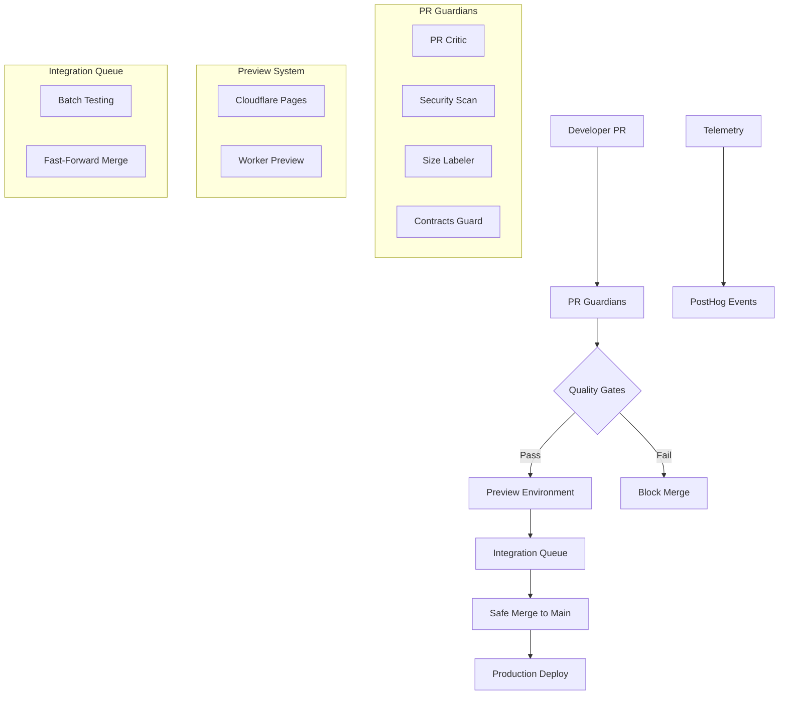

# DevOps Layer - PRAVADO Platform

## Overview

The PRAVADO platform implements a comprehensive DevOps layer that ensures quality, security, and reliability through automated delivery pipelines, PR guardians, preview environments, and safe integration practices.

## Architecture



## Components

### 1. Delivery Telemetry

**PostHog Event Tracking** (`scripts/devops/ph-event.ts`)

Events tracked throughout the delivery pipeline:
- `dev_pr_opened` - When a PR is created
- `dev_ci_started` - CI pipeline begins
- `dev_ci_passed` / `dev_ci_failed` - CI completion status
- `dev_integration_queue_entered` - PR enters integration queue
- `dev_integration_ci_passed` / `dev_integration_ci_failed` - Integration results

**Properties tracked:**
```typescript
interface DeliveryEvent {
  pr: number
  sha: string
  branch: string
  actor: string
  size: 'XS|S|M|L|XL'
  contracts_touched: boolean
  endpoints_touched: boolean
  ci_duration_s?: number
  est_cost_usd?: number
}
```

### 2. PR Guardians

#### PR Critic (`.github/workflows/pr-critic.yml`)
Validates PR template completion and enforces approval requirements:

**Required Sections Validated:**
- Scope description
- Contracts touched (Yes/No)
- Endpoints added/changed
- Tests added with coverage
- Screenshots for UI changes
- Risk assessment & rollout plan
- Agent metadata (if AI-assisted)

**Approval Requirements:**
- `architect-approved` label for contract/type changes
- `security-reviewed` label for worker/migration changes

#### Security Scan (`.github/workflows/security-scan.yml`)
Automated security scanning with multiple tools:
- **Gitleaks** - Secret detection
- **npm audit** - Dependency vulnerabilities  
- **OSV Scanner** - Open source vulnerabilities
- **Semgrep** - SAST analysis

**Fail Conditions:**
- Any secrets detected
- High/critical vulnerabilities in dependencies
- Security anti-patterns in code

#### Size Labeler (`.github/workflows/size-labeler.yml`)
Automatically categorizes PRs by change size:
- **XS**: < 50 lines changed 🐭
- **S**: 50-199 lines changed 🐹
- **M**: 200-499 lines changed 🐰
- **L**: 500-999 lines changed 🐺
- **XL**: 1000+ lines changed 🐘

#### Contracts Guard (`.github/workflows/contracts-guard.yml`)
Special handling for API contract changes:
- Detects changes to `packages/contracts/`, `packages/types/`, API routes
- Builds and tests contracts in isolation
- Generates diff summaries for reviewers
- Requires `architect-approved` label

### 3. Preview System

#### Preview Comment (`.github/workflows/preview-comment.yml`)
Automatically creates preview environments for PRs:

**Frontend Preview** (Cloudflare Pages):
- URL: `https://pravado-app-pr-{number}.pages.dev`
- Automatic deployment on PR updates
- Health check validation

**API Preview** (Cloudflare Workers):
- URL: `https://pravado-api-pr-{number}.workers.dev`
- Health endpoint: `/health`
- Isolated database environment

**PR Comments include:**
- Live preview URLs
- Health check status
- Test commands for manual validation

### 4. Integration Queue

#### Safe Parallel Merging (`.github/workflows/integration-queue.yml`)
Prevents merge conflicts and broken main branch:

**Process:**
1. PR labeled with `ready-to-queue` (manual trigger)
2. Verify all CI checks are green
3. Create integration branch from latest main
4. Merge PR into integration branch (no squash)
5. Run full CI suite on integration branch
6. If successful: fast-forward main to integration branch
7. If failed: preserve integration branch for debugging

**Benefits:**
- No broken main branch commits
- Parallel PR processing
- Full integration testing
- Debugging capability on failures

## Workflow Triggers

### Automatic Triggers
- **On PR Open/Update**: Size labeling, preview deployment, security scan
- **On Contract Changes**: Contracts guard, architect approval required
- **On Main Push**: Production deployment, telemetry events

### Manual Triggers
- **`ready-to-queue` label**: Integration queue processing
- **Re-run failed checks**: Individual workflow re-execution

## Quality Gates

### Merge Requirements
1. **All CI checks must pass**
2. **Security scan clean**
3. **PR template completed**
4. **Appropriate approvals**:
   - `architect-approved` for contract changes
   - `security-reviewed` for security-sensitive changes
5. **Test coverage ≥ 80%** (warning if below)

### Integration Requirements
1. **Green CI status**
2. **No merge conflicts**
3. **Full integration CI suite passes**
4. **Fast-forward merge possible**

## Monitoring & Alerting

### PostHog Dashboards
Track delivery metrics:
- PR throughput and size distribution
- CI success/failure rates
- Integration queue performance
- Security scan results
- Deployment frequency

### Slack Notifications (optional)
Configure `SLACK_WEBHOOK_URL` for:
- Integration queue results
- Security scan failures
- Production deployment status

## Configuration

### Required GitHub Secrets
```
CLOUDFLARE_API_TOKEN      # Worker/Pages deployment
CLOUDFLARE_ACCOUNT_ID     # Cloudflare account
POSTHOG_API_KEY          # Telemetry events
CODECOV_TOKEN            # Coverage reporting (optional)
SLACK_WEBHOOK_URL        # Notifications (optional)
```

### Repository Settings
- **Branch Protection**: Require PR reviews, status checks
- **Auto-delete head branches**: Clean up after merge
- **Labels**: Ensure size labels and approval labels exist

## Best Practices

### For Developers
1. **Use descriptive PR titles** - Helps with telemetry tracking
2. **Complete PR template** - Required for merge
3. **Keep PRs small** - Easier review and faster integration
4. **Test preview links** - Validate changes before merge
5. **Monitor integration queue** - Don't stack too many PRs

### For Maintainers  
1. **Review telemetry data** - Identify bottlenecks
2. **Monitor security scans** - Address vulnerabilities promptly
3. **Use integration queue** - Safe parallel processing
4. **Approve contract changes** - Maintain API stability
5. **Clean up integration branches** - Failed merges leave branches

### For Operations
1. **Monitor PostHog events** - Delivery pipeline health
2. **Set up alerting** - Failed deployments, security issues
3. **Regular secret rotation** - API tokens and keys
4. **Backup strategies** - Code and configuration
5. **Capacity planning** - Cloudflare limits and costs

## Troubleshooting

### Common Issues

**Integration Queue Stuck**
- Check integration branch exists
- Verify CI permissions
- Manual cleanup: delete integration branch, re-label PR

**Security Scan False Positives**
- Update `.semgrepignore` for code patterns
- Use `npm audit fix` for dependency issues
- Rotate secrets detected by gitleaks

**Preview Environment Issues**
- Check Cloudflare API token permissions
- Verify account limits not exceeded
- Manual deploy via wrangler CLI

**Coverage Failures**
- Ensure test command generates coverage
- Check `coverage/` directory exists
- Verify Jest/Vitest configuration

## Metrics & KPIs

Track these delivery metrics:
- **Lead Time**: PR open to production deploy
- **Deployment Frequency**: Daily/weekly deployment count
- **Change Failure Rate**: Failed deployments / total deployments
- **Recovery Time**: Time to fix broken deployments
- **Integration Queue Efficiency**: Success rate, average time
- **Security Posture**: Vulnerabilities found/fixed, scan coverage

## Future Enhancements

### Planned Improvements
1. **Automated rollback** - On production failure detection
2. **Canary deployments** - Gradual feature rollouts
3. **Performance monitoring** - Lighthouse CI integration
4. **Dependency updates** - Automated security patches
5. **Multi-environment** - Staging/production parity

### Advanced Features
1. **Feature flags integration** - LaunchDarkly/PostHog experiments
2. **Load testing** - Automated performance validation
3. **Compliance scanning** - GDPR, SOC2, PCI requirements
4. **Infrastructure as Code** - Terraform/Pulumi management
5. **Chaos engineering** - Resilience testing automation