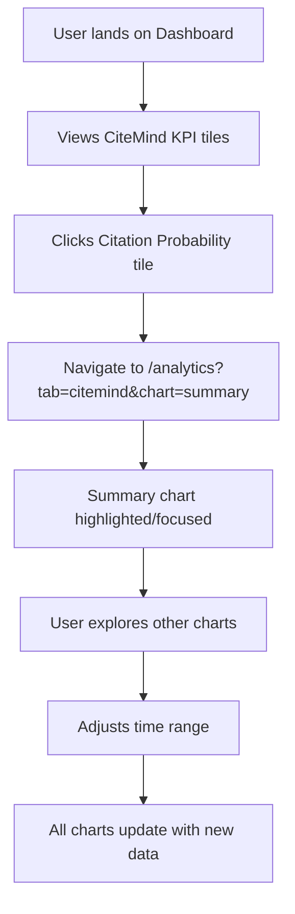
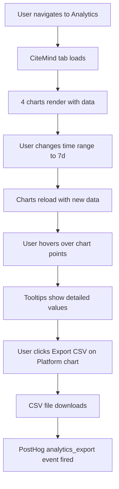
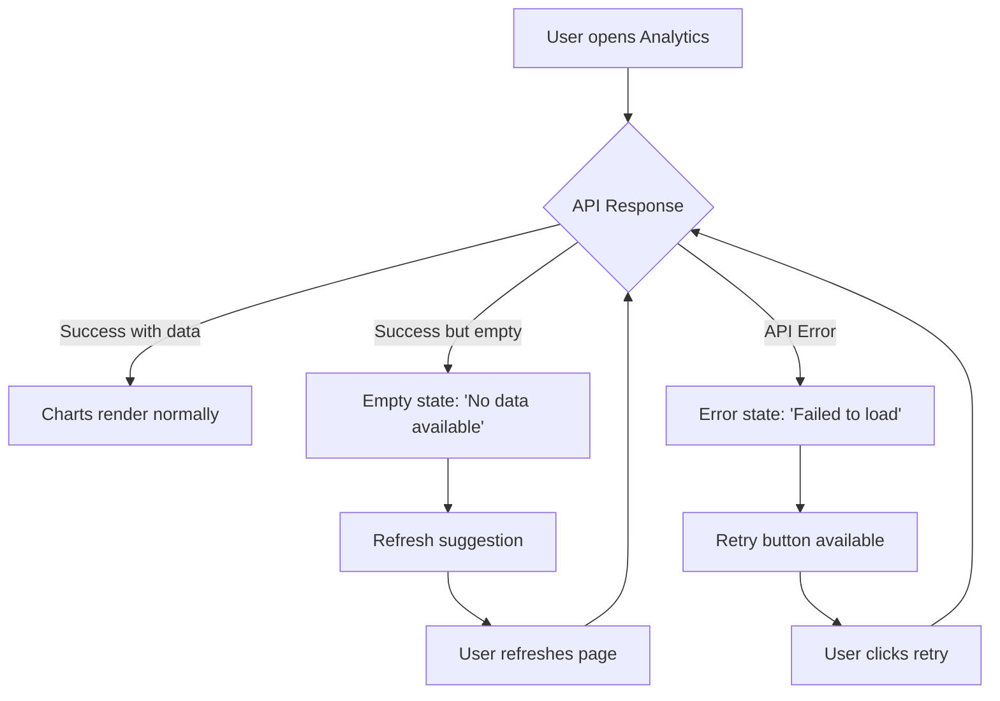

# UI Analytics - CiteMind Dashboard & Analytics

## Overview

The PRAVADO platform includes a comprehensive analytics interface for CiteMind performance tracking, featuring interactive dashboards, drill-down capabilities, and data export functionality.

## User Interface Components

### 1. Dashboard KPI Tiles

**Location**: `/dashboard`

#### CiteMind Performance Section
- **Citation Probability**: Displays average citation rate as percentage
- **Platform Coverage**: Shows AI platform reach percentage  
- **Authority Index**: Content authority score (0-100 scale)
- **Time-to-Citation**: Median time for content to be cited

**Key Features**:
- Real-time data updates (hourly refresh)
- Trend indicators with directional arrows
- Click-to-drill-down functionality
- Responsive grid layout

#### Tile Interactions
```
User Action: Click on any KPI tile
Result: Navigate to Analytics → CiteMind tab with relevant chart focused
Telemetry: dashboard_tile_clicked event with tile_id and drill_down_path
```

**Visual Design**:
- Clean card-based layout
- Color-coded tiles (blue, green, purple, orange)
- Hover animations and scaling effects
- Trend indicators with contextual colors

### 2. Analytics Dashboard

**Location**: `/analytics?tab=citemind`

#### Tab Navigation
- **Overview**: General analytics summary (coming soon)
- **CiteMind**: Citation performance analytics (active)
- **Performance**: System performance metrics (coming soon) 
- **AI Insights**: ML-powered insights (coming soon)

#### Time Range Selector
**Options**: 7 days, 30 days, 90 days, 1 year
**Default**: 30 days
**Behavior**: Updates all charts and exports when changed

#### Chart Types

**1. Citation Probability & Authority Index Over Time**
- **Type**: Dual-axis line chart
- **Data Source**: `GET /analytics/citemind/summary`
- **Left Y-Axis**: Citation Probability (0-1 scale)
- **Right Y-Axis**: Authority Index (0-100 scale)
- **Features**: Interactive tooltips, chart legend, CSV export

**2. Platform Coverage by Platform**
- **Type**: Bar chart
- **Data Source**: `GET /analytics/citemind/platforms`  
- **Metrics**: Citation rate percentage by platform (ChatGPT, Claude, Perplexity, Gemini)
- **Features**: Hover details, color-coded bars, CSV export

**3. Time-to-Citation Distribution**
- **Type**: Histogram
- **Data Source**: `GET /analytics/citemind/ttc`
- **Buckets**: 0-1h, 1-6h, 6-24h, 1-3d, 3-7d, 7d+
- **Features**: Distribution analysis, median calculation, CSV export

**4. Citation Frequency vs Content Velocity**
- **Type**: Dual-line chart
- **Data Source**: `GET /analytics/citemind/visibility-mix`
- **Blue Line**: Daily citation frequency
- **Orange Line**: Daily content velocity
- **Features**: Correlation analysis, trend comparison, CSV export

#### Summary Metrics Panel
Displays key performance indicators at the bottom:
- Avg Citation Probability (percentage)
- Platform Coverage (percentage)
- Authority Index (0-100 score)
- Median TTC (hours)
- Total Citations (count)

### 3. Data Export Functionality

#### CSV Export Options
- **Individual Charts**: Export button on each chart
- **Export All**: Bulk export of all chart data
- **Format**: CSV with proper headers and formatting
- **Filename**: `citemind-{endpoint}-{range}.csv`

#### Export Process
```
1. User clicks "Export CSV" button
2. PostHog event: analytics_export tracked
3. Direct download link created with format=csv parameter
4. Browser initiates file download
5. Success feedback (optional)
```

## User Flows

### Flow 1: Dashboard to Analytics Drill-Down



**Expected Behavior**:
1. Dashboard loads with CiteMind tiles visible above general KPIs
2. Tiles show current data with trend indicators
3. Click animation provides visual feedback
4. Analytics page opens with CiteMind tab active
5. Relevant chart section is scrolled into view (if specified)

### Flow 2: Analytics Exploration and Export



**Expected Behavior**:
1. All charts load simultaneously with loading states
2. Time range change triggers API calls for all endpoints
3. Charts update smoothly with new data
4. Export generates properly formatted CSV
5. Telemetry events track user interactions

### Flow 3: Error and Empty State Handling



**Error Messages**:
- **API Failure**: "Failed to load analytics data"
- **Empty Data**: "No CiteMind analytics data found for the selected time range"
- **Network Error**: "Unable to connect to analytics service"

## Technical Implementation

### State Management
- **Time Range**: Global state shared across all charts
- **Loading States**: Individual loading states per chart
- **Error Handling**: Component-level error boundaries
- **Cache**: No client-side caching (always fetch fresh data)

### Performance Optimizations
- **Lazy Loading**: Charts render only when tab is active
- **Debounced API Calls**: Time range changes debounced by 500ms
- **Canvas Rendering**: Chart.js for efficient chart rendering
- **Responsive Design**: Charts adapt to screen size

### Telemetry Events

#### Key Events Tracked
```typescript
// Dashboard interactions
analytics_viewed: { tab: 'citemind', time_range: '30d' }
dashboard_tile_clicked: { tile_id: 'citation_probability', drill_down_path: '/analytics?tab=citemind' }

// Analytics interactions  
analytics_export: { endpoint: 'summary', time_range: '30d', format: 'csv' }
time_range_changed: { old_range: '30d', new_range: '7d', page: 'analytics' }
chart_interaction: { chart_type: 'line', action: 'hover', data_point: {...} }
```

#### PII Safety
- No user-identifying information in telemetry
- Only aggregate metrics and interaction patterns
- Time ranges and feature usage only

### API Integration

#### Endpoint Mapping
```typescript
const ENDPOINTS = {
  summary: '/analytics/citemind/summary',
  platforms: '/analytics/citemind/platforms', 
  ttc: '/analytics/citemind/ttc',
  visibilityMix: '/analytics/citemind/visibility-mix'
}
```

#### Request Parameters
- `range`: Time range (7d, 30d, 90d, 1y)
- `format`: Response format (json, csv)

#### Response Handling
- Success: Render charts with data
- Empty: Show empty state component
- Error: Show error state with retry option
- Loading: Show skeleton loading states

## Testing

### E2E Test Coverage

#### Covered Scenarios
✅ Dashboard tiles display and link correctly  
✅ Analytics charts render with seeded data  
✅ Time range selector updates all charts  
✅ CSV export downloads work correctly  
✅ Empty state handling for no data  
✅ Error state handling for API failures  
✅ Loading states display properly  
✅ Mobile responsive layout  
✅ Telemetry events fire correctly  

#### Test Data
- **Mock API responses** for deterministic testing
- **Seeded data scenarios**: normal, empty, error, high-volume
- **Fixed dates** for consistent time-based tests
- **Network interception** to avoid CI flakiness

### Manual Testing Checklist

#### Dashboard Tiles
- [ ] All 4 KPI tiles display
- [ ] Values are formatted correctly (percentages, numbers, hours)
- [ ] Trend indicators show appropriate colors
- [ ] Hover effects work smoothly
- [ ] Click navigation works
- [ ] Mobile layout stacks properly

#### Analytics Charts
- [ ] All 4 charts load with data
- [ ] Chart tooltips provide detailed information
- [ ] Time range selector affects all charts
- [ ] CSV exports download with correct filenames
- [ ] Loading skeletons appear during data fetch
- [ ] Empty and error states display appropriately

#### Cross-Browser Compatibility
- [ ] Chrome: Full functionality
- [ ] Firefox: Charts and interactions work
- [ ] Safari: Export downloads work
- [ ] Edge: Responsive design intact

## Deployment Notes

### Environment Variables
```bash
VITE_API_BASE_URL=https://pravado-api.workers.dev
VITE_POSTHOG_KEY=phc_your_key_here
VITE_POSTHOG_HOST=https://app.posthog.com
```

### Build Requirements
- **Chart.js dependencies** included in bundle
- **PostHog SDK** for telemetry
- **Responsive images** optimized for different screen densities
- **Browser compatibility** for modern browsers (ES2018+)

### Performance Targets
- **Time to Interactive**: < 2 seconds
- **Chart Render Time**: < 500ms per chart
- **API Response Time**: < 1 second (backend target)
- **Bundle Size**: Analytics components < 200KB gzipped

This comprehensive analytics interface provides users with actionable insights into their CiteMind performance while maintaining excellent user experience and technical reliability.